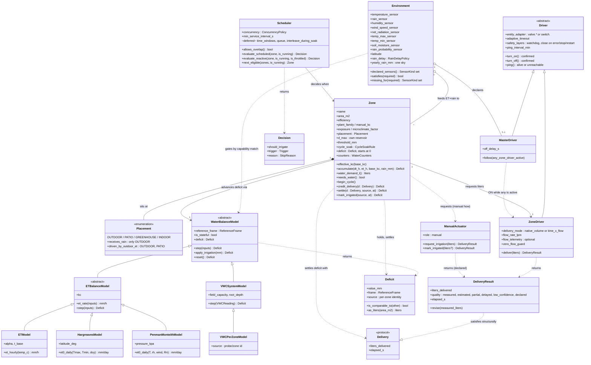

# Design — Domain Object Model

**Status:** Accepted (ADR), 2026-08-16
**Date:** 2026-07-05 (updated 2026-07-06 with review feedback from GH #74; 2026-07-23 aligned with the water-balance reference model; 2026-07-26 the water-balance model made a first-class object; 2026-08-01 RFC to dissolve `System` into `Environment` + capability-matched models)
**Related:** GH #74 (actuator abstraction discussion), GH #94 (`valve.*` support), GH #95 (master valve/pump), [Water-Balance Reference Model](design_water_balance_reference_model.md) (where the deficit lives), [Domain Model Anomalies](design_domain_model_anomalies.md) (code-verified audit against this model)

## Purpose

Define the conceptual objects of NeverDry's irrigation domain, independent of the current
module layout. This model guides where new features belong (e.g. "does the master valve go
in the scheduler or in the system?") and what should become an explicit first-class object
as the codebase evolves. For the current module/data-flow architecture see
`developer_manual.md` §1.

## The five objects

| Object | Responsibility | Key attributes |
|---|---|---|
| **Environment** | The **site**: what this installation has, and what it can therefore compute | The declared sensor inventory (temperature, rain, humidity, wind, net radiation, tmax/tmin, soil probe, rain probability) + latitude; **capability matching** — a zone may offer only the models this inventory can feed; yearly rain, one sky over the whole garden; the forecast rain-delay threshold. Written in `environment.py`. Replaces the former **System**, which was dissolved rather than renamed (α → `ETModel`, D_max → `Zone`, master valve → `MasterDriver`) |
| **Zone** | Irrigation unit; owns its deficit and translates it into water demand | Kc / plant family, area, efficiency, site exposure; **placement** (outdoor/patio/greenhouse/indoor — gates whether rain reaches it); **its own D_max**, the reservoir of this soil; cycle & soak rule; **its own deficit** (`+ET·Kc·Δt − rain − irrigation`, new zone starts at 0); translates mm → liters. Written in `zone.py` |
| **Scheduler** | The *when* — and the concurrency policy | Time windows, sequences, calendars; serial vs parallel zone runs, interleaving during soak |
| **ZoneDriver** | The *how* — actuation of one zone's water demand | Entity adapter (`valve.*`/`switch.*`), delivery mode (native volume in liters vs time in seconds via flow rate), flow rate, zero-flow guard; returns a **DeliveryResult** |
| **MasterDriver** | Coordination of shared hydraulics (pump / master valve) | ON when any ZoneDriver is active, OFF when none; configurable off-delay; no notion of liters |

ZoneDriver and MasterDriver are two specializations of a common **Driver** base, which owns
what they share: the entity adapter, ON/OFF command with state confirmation, adaptive
latency/timeout, and the safety layers (watchdog, close on error/stop/restart).

## The water-balance model (the *how much*)

Where the **Driver** abstracts the *how* of actuation, the **WaterBalanceModel** abstracts the
*how much*: the scientific computation of a zone's water demand. It is the object that turns
whatever inputs a user's setup provides into a **Deficit**. It has two symmetries with the
Driver side, and modeling it explicitly buys the same thing the Driver did:

| Sensing side (*how much*) | Actuation side (*how*) |
|---|---|
| **WaterBalanceModel** (abstract strategy) | **Driver** (abstract) |
| ↳ `ETModel`, `VWCSystemModel`, `VWCPerZoneModel` | ↳ `ZoneDriver`, `MasterDriver` |
| **Deficit** (mm + reference frame) — the value returned | **DeliveryResult** (liters + quality) — the value returned |

- **WaterBalanceModel** — a strategy that produces a `Deficit`. Its concretes mirror the
  reference frames of the [Water-Balance Reference Model](design_water_balance_reference_model.md):
  the ET frame is an abstract `ETBalanceModel` (shared forward-Euler integration, pluggable ET
  rate) with three **tiers** by input cost — `ETModel` (temperature-only, today's baseline; any
  user can run it), `HargreavesModel` (FAO-56 Hargreaves-Samani; adds the diurnal temperature
  range, its radiation term is computed from latitude + date, so still **no extra sensor**), and
  `PenmanMonteithModel` (FAO-56 Penman-Monteith, physically grounded, needs humidity + wind + net
  radiation — inputs not every user has); plus `VWCSystemModel` (one system moisture probe,
  stateless) and `VWCPerZoneModel` (a per-zone probe — the AI-174 target). Adding a tier is one
  new `et_rate`, not a new integrator: the "user picks the ET method their sensors support"
  design falls straight out of the output seam.
- **Deficit** — the value object every model returns: millimetres **plus the reference frame**
  they are defined against. A bare number is not enough — the reference model's load-bearing rule
  is that *two deficits are comparable only within one frame*, so the frame (and, for per-zone
  probes, the source identity) travels with the value.

**The seam is the output, not the input.** The three models share no inputs — ET needs weather,
VWC needs a probe, and not every user has a soil-moisture sensor. What they share is the
**output**: every model yields a `Deficit` in mm. This is precisely why plug-and-play works at
the output and not the input: each model copes with the sensors it has and exposes the same
quantity, so a setup can switch models (or fall back ET ⇄ VWC) without the Zone knowing which
one ran. This also unifies the ET formula that today lives in two places (`ETSensor` and
`DrynessIndexSensor`) into a single `ETModel.et_hourly`.

Ownership follows the reference model unchanged: the **Environment** owns the shared feeds/probe, the
**Zone** owns its `Deficit` and its `Kc`. The model is the *mechanism* the Zone uses to advance
that deficit; `Kc` is passed into a per-zone `ETModel` instance (the system reference uses
`Kc = 1.0`), because per-zone irrigation resets are independent and a shared reference cannot be
scaled proportionally after the fact.

## Translation chain

```
Environment provides the feeds + the inventory  temperature, rain, RH, wind, Rn, tmax/tmin,
   │                                              probe, rain probability, latitude
   │            gates which models a zone may run  declared_sensors ⊇ model.required_sensors
   │
Zone        accumulates its own deficit (mm)      +ET·Kc·Δt − rain − irrigation; new zone starts at 0
   │         rain credited only if placement       is open to the sky
   │         then translates mm → liters (area)    applies cycle & soak, own D_max
   │
ZoneDriver translates liters → actuation        native volume if supported,
   │                                            else seconds via flow rate
Scheduler  decides in which window it happens
```

Liters are the **contract** between Zone and ZoneDriver: the zone always requests liters;
only the driver knows whether to deliver them by volume or by time. This makes the fallback
natural — same request, two actuation strategies.

The contract is a **round trip**: the driver does not just execute "water X liters", it
returns a **DeliveryResult** — the liters actually delivered, stated as truthfully as the
backend allows (see the design decision below).

## Class diagram


*Rendered diagram (`assets/domain_model_uml.svg`) — blue is the liters contract going
down, green is the truth flowing back. The Mermaid source below is the normative
definition; keep the two in sync.* ⚠️ **The SVG predates the 2026-08-09 revision** and
still shows `System` rather than `Environment`, without `Placement` or the `Delivery`
protocol. Re-render it before this document is next published.*



`Zone` depends on `Delivery`, the structural protocol, rather than on `DeliveryResult` itself.
That is what keeps `zone.py` free of Home Assistant while `driver.py` — which owns the entity
adapters — necessarily is not. `DeliveryResult` satisfies the protocol without either module
importing the other.

`ManualActuator` is a third materialization of the *how* — but deliberately **not** a
`Driver`: there is no entity, no FSM, no safety layers to inherit. It shares only the delivery
**contract** (`→ DeliveryResult`), so the Zone settles its deficit identically whether the
water came from a valve or a watering can.

Reading keys: liters flow down the association `Zone → ZoneDriver` and truth flows back up as
a `DeliveryResult`; the `Scheduler` never touches drivers — it only decides *which zone when*
(and, with cycle & soak, may interleave another eligible zone during a soak pause);
`MasterDriver` reacts to the aggregate driver activity, it takes no decisions. The liveness
`ping()` lives in the abstract `Driver`, so both specializations inherit it.

## The classes in detail

Attribute-by-attribute and method-by-method reference for each class, with the
responsibility that justifies every member. This expands the diagram above; the
diagram stays the source of truth for relationships.

### Environment — `environment.py`

The site: which sensors this installation declared, and therefore which models it can run.
*Declares* the master valve/pump but never commands it. Holds bindings — entity ids as opaque
strings — never readings.

| Member | Kind | Meaning |
|---|---|---|
| `temperature_sensor`, `rain_sensor` | attr | The two feeds every ET tier consumes |
| `humidity_sensor`, `wind_speed_sensor` | attr | What unlocks Penman-Monteith |
| `net_radiation_sensor` | attr | A pyranometer (solar radiation). Improves Penman-Monteith; not required, since the radiation is estimated from the diurnal range when absent. Named for the quantity the equation reads, not the one the user supplies — a rename worth doing |
| ~~`temp_max_sensor`, `temp_min_sensor`~~ | — | **Withdrawn.** The daily extremes are observed from the thermometer (`DiurnalRange`), not declared: the same entity in both fields gives a zero range and an evapotranspiration of exactly zero |
| `soil_moisture_sensor` | attr | What unlocks VWC mode |
| `rain_probability_sensor` | attr | Forecast feed behind the rain delay |
| `latitude` | attr | A property of the place: the astronomical radiation term, and the hemisphere flip of the seasonal Kc |
| `rain_sensor_type`, `backfill_days` | attr | How to read the rain feed, and how far back to replay |
| `rain_delay: RainDelayPolicy` | attr | Threshold + delay. The site supplies the *signal*; it never skips a watering itself |
| `yearly_rain_mm` | attr | Rain this calendar year — one sky over the whole garden (reference model D3). Note the asymmetry with the deficit, which is emphatically not shared |
| `declared_sensors → {SensorKind}` | property | Every kind actually bound to an entity |
| `satisfies(required) → bool` | method | The whole capability rule: `declared ≥ required` |
| `missing_for(required) → {SensorKind}` | method | *Which* sensor unlocks a model — what the UI needs to say |
| `accrue_yearly_rain(mm, year)` | method | Credits positive increments only; a decreasing reading is never rain (GH #123) |

### Zone — `zone.py`

The irrigation unit: owns its deficit, turns it into litres, and settles it with the driver's
reported truth.

| Member | Kind | Meaning |
|---|---|---|
| `name` | attr | Identity; also the `source` tag on its `Deficit` |
| `area_m2`, `efficiency` | attr | Irrigated surface, and how much of what is emitted reaches the root zone |
| `plant_family`, `manual_kc` | attr | What grows here — the seasonal curve, or an explicit override |
| `exposure`, `microclimate_factor` | attr | Sun and wind relative to an open site (GH #146) |
| `placement: Placement` | attr | Where the zone sits. `receives_rain` is true only outdoors; `driven_by_outdoor_et` also covers a patio |
| `d_max` | attr | **This soil's** reservoir. Only the clamping mechanism is shared across models |
| `threshold_mm` | attr | Deficit that triggers irrigation |
| `cycle_soak: CycleSoakRule` | attr | Dose/pause — a Zone rule, not a Scheduler policy |
| `deficit: Deficit` | attr | Its own deficit, carrying its reference frame. A new zone starts at 0 (D4) |
| `counters: WaterCounters` | attr | last / session / total / yearly delivered litres |
| `effective_kc(base_kc)` | method | Applies site exposure. The seasonal curve is deliberately *not* recomputed here — copying its plant table in would create the second source of truth anomaly E1 is about |
| `accumulate(dt_h, et_h, base_kc, rain_mm)` | method | `+ET·Kc·Δt − rain`, clamped. Rain is credited only when `placement.receives_rain` |
| `water_demand_l` | property | mm → litres via area and efficiency; litres are the contract towards the driver |
| `needs_water` | property | Deficit has reached the threshold |
| `begin_cycle()` | method | Opens a cycle, snapshotting the deficit it starts from |
| `credit_delivery(d: Delivery)` | method | **The one crediting formula.** Subtracts from the snapshot while a cycle is open, from the current value otherwise — which is what makes repeated real-time credits idempotent |
| `settle(d, source, at)` | method | Credits the final figure, stamps it, drops the snapshot — exactly once |
| `mark_irrigated(source, at)` | method | The hose case: nothing was measured, so the volume is inferred from the deficit being cleared |

### Scheduler

The *when* and the concurrency policy. It never touches drivers: it only decides which
zone runs in which window.

The seam is **decision versus execution**: the scheduler answers "may this zone water now, and
why not"; registering time listeners, spawning tasks and driving valves stay on the Home Assistant
side. It takes the world's facts (`is_running`, `is_throttled`) as arguments rather than reading
them, which is what makes the rules testable without a controller.

| Member | Kind | Meaning |
|---|---|---|
| `concurrency` | attr | `SERIAL` (today's behaviour) or `PARALLEL`. Naming it turns an emergent property — both handlers happen to bail when something is running — into a stated policy |
| `min_service_interval_s` | attr | Rate limit between service calls with the same key |
| `evaluate_scheduled(zone, is_running) → Decision` | method | The daily top-up. Deliberately does **not** consult the threshold: gating a schedule on the reactive threshold turns every scheduled run into a reactive one (AI-183). Only a zone already full is skipped |
| `evaluate_reactive(zone, is_running, is_throttled) → Decision` | method | Mode A: water once the deficit crosses the zone's threshold |
| `next_eligible(zones, is_running) → Zone` | method | Driest first — an ordering that needs no memory. Deliberately **not** a queue: a queue remembers what is waiting, which is the deferred design |
| `Decision` | value object | Water (with a `Trigger`) or skip (with a named `SkipReason`). The reasons are named because two of them — `ALREADY_RUNNING`, `THROTTLED` — are what make a watering look mysteriously missing |

**Deliberately absent:** time windows, calendars, the queue, parallel runs and interleaving during
soak. Those are deferred until a concrete demand for parallel zones appears (GH #74). Writing them
now would be building a mechanism for a question nobody has asked; what the module does contain is
behaviour that already runs, merely written where it can be read.
| `interleave_during_soak()` | method | During a soak pause it may interleave another eligible zone |

### Driver «abstract»

The common base of the two specializations: everything about commanding a physical entity
and not blindly trusting the answer.

| Member | Kind | Meaning |
|---|---|---|
| `entity_adapter` | attr | Adapter over the HA entity (`valve.*` or `switch.*`) |
| `adaptive_timeout` | attr | Verification window adapted to observed latency (rolling mean + 3σ) |
| `safety_layers` | attr | Watchdog; close on error/stop/restart |
| `ping_interval_min` | attr | Active liveness: periodic ping, not just passive state |
| `turn_on() / turn_off()` | method | Command with state confirmation (and bounded retry with backoff) |
| `ping() → alive \| unreachable` | method | Reachability check independent of commands |

### ZoneDriver

The *how* for a single zone: receives liters, picks the actuation strategy, returns the
truth.

| Member | Kind | Meaning |
|---|---|---|
| `delivery_mode` | attr | `native_volume` when the device doses in liters, otherwise `time × flow` (seconds via flow rate) |
| `flow_rate_lpm` | attr | Nominal guard flow rate (L/min) |
| `flow_telemetry` | attr | Flow telemetry, when available (optional) |
| `zero_flow_guard` | attr | Guard against zero-flow sessions |
| `deliver(liters) → DeliveryResult` | method | Actuates the request and reports delivered liters with their degree of truth |

### MasterDriver

Coordinates the shared hydraulics (pump / master valve). Reacts to aggregate driver
activity, takes no decisions, has no notion of liters.

| Member | Kind | Meaning |
|---|---|---|
| `off_delay_s` | attr | Linger delay after the last active zone |
| `follow(any_zone_driver_active)` | method | ON while any ZoneDriver is active, OFF (after the linger) when none is |

### DeliveryResult

The return trip of the truth: the driver does not just execute — it states how much it
delivered and how much that figure can be trusted.

| Member | Kind | Meaning |
|---|---|---|
| `liters_delivered` | attr | Liters actually delivered, as far as the backend allows to know |
| `quality` | attr | `measured` · `estimated` · `partial` · `delayed` · `low_confidence` |
| `elapsed_s` | attr | Real session duration |
| `revise(measured_liters)` | method | Late revision for slow-reporting backends (e.g. Hydrawise): the true measure arrives later and corrects the estimate |

**Proposed addition (backlog AI-163, not yet part of the model):** a `device_reported`
quality level between `measured` and `estimated`, fed by the device's own end-of-session
report (duration + start/end volume — e.g. Sonoff SWV via Z2M). Some valves cannot stream
flow in real time but do report a trustworthy session total: more truthful than a
`flow_rate × time` estimate, less than live metering. It belongs to the driver as a
capability and will land with the driver abstraction.

## Design decisions

### The deficit lives in the Zone; the site holds feeds, not state

The `Environment` is not a global deficit. It owns the shared **feeds** — the
temperature sensor (→ ET) and the rain sensor — and broadcasts them; each Zone
accumulates **its own** deficit (`+ET·Kc·Δt − rain − irrigation`). Irrigating a
zone resets only that zone. A new zone starts at 0 rather than inheriting a
global reference, which drifts high under per-zone irrigation. The old global
"Dryness Index" accumulator is retired as ET state (kept only as an interim
system-level value for the single-probe VWC mode). The full rationale, reference
frames, and the retire/keep table are in the
[Water-Balance Reference Model](design_water_balance_reference_model.md)
(decisions D1–D5).

### Master valve/pump: declared at site level, executed by a Driver

The master valve is not scheduling logic — it takes no decisions. It reacts to the aggregate
execution state (an OR over zone drivers), with an off-delay to avoid pump cycling during
sequential zone runs. It is shared hydraulic infrastructure, like the global sensors, so its
*configuration* lives at system level (as requested in GH #95: "master entity configurable at
integration level").

Its *execution* however is a Driver: modeling it as a Driver specialization means the safety
layers (never leave the pump running on error/stop/restart) are written once in the base and
inherited — instead of duplicating watchdog and error handling inside "system" as a special
case.

### Cycle & soak: a Zone rule

Cycle/soak parameters depend on soil infiltration rate and zone properties (slope, soil
type), so they are per-zone configuration. The *execution* of the cycles is driver/controller
mechanics, but the rule lives in the Zone.

### DeliveryResult: the driver reports the most truthful delivered value it can

*From the GH #74 review (fpytloun, 2026-07-06).* Estimating delivered liters from expected
flow can diverge badly from reality — a dirty filter reduces the actual flow rate; a backend
like Hydrawise refreshes measured values only periodically, so the true figure may arrive
late. And for some backends, **command acceptance, physical valve state, and final measured
delivery are three distinct moments**, not one.

The driver therefore returns a **DeliveryResult**, not a bare number: delivered liters plus a
**quality qualifier** — `measured`, `estimated`, `partial`, `delayed`, `low-confidence`. Rules:

- The driver always reports the *most truthful* value available for its backend: cumulative
  flow-meter reading first, flow-rate integration second, configured flow × elapsed time as
  the estimated floor, each labeled accordingly.
- A result may be **revised**: a backend that reports measured volume late (e.g. a periodic
  API refresh) first returns an estimated/`delayed` result and corrects the deficit settlement
  when the measured figure lands.
- A `partial` or zero result with the valve confirmed open still **settles the deficit** with
  the best available estimate — the water was physically delivered whether or not it was
  measured (this is the field bug behind the zero-measured-flow timeout: an unmeasured
  session must never leave the deficit untouched and trigger a retry loop).

The Zone consumes the DeliveryResult to settle its deficit; the quality qualifier flows into
diagnostics (session log, `SESSION_RESULT`) so the user can see *how* the figure was obtained.

**Cycle & soak makes delivery self-correcting.** When a zone waters in cycles, the gap
between the liters requested and the most truthful delivered value of one cycle is simply
added to the next cycle's request: an under-delivery (dirty filter, low pressure, partial
result) is **replenished within the same session**, instead of surfacing a day later as
residual deficit. This is a direct synergy between the DeliveryResult contract and the
cycle & soak rule — it requires truthful per-cycle accounting to work.

### Manual actuation: a valve-less *how* for hand-watered plants

*Idea 2026-07-26.* Not every plant has a valve. A **house plant** is watered by hand, so its
"actuation" is a person: NeverDry raises an **alert** when the deficit says water is due, and
the user presses **Mark irrigated** once they have watered. `ManualActuator` models this as a
third materialization of the *how* — a materialization that proves the abstraction, because it
has **no hardware at all**.

It deliberately does not extend `Driver`: there is no entity, no FSM, no watchdog,
no liveness. It shares only the delivery **contract** (`→ DeliveryResult`), so the Zone settles
its deficit identically whether the water came from a valve or a watering can. Two existing
pieces are reused rather than reinvented: the alert is a **notification**, and **Mark
irrigated** is the existing `reset_deficit` action, here doubling as the delivery confirmation.
The human-paced, asynchronous nature is already covered by the DeliveryResult contract:
`request_irrigation()` returns a `delayed` pending result and `mark_irrigated()` the final one,
tagged with a new **`declared`** quality (assumed/declared by a human, not measured) — a person
is simply the extreme case of "a backend that measures late".

**Actuation and model are orthogonal.** A house plant picks the manual *how* **and** the right
*how much*: indoors the demand is not weather-driven, so it pairs with a VWC / indoor
water-balance model, **not** `ETModel`. The two axes (`Driver` family × `WaterBalanceModel`
family) compose freely — a house plant is just one corner of that grid.

**To explore (open questions, not decided):**
- A **placement attribute** on the Zone — `indoor` / `outdoor` / `greenhouse` — that could
  select sensible defaults (which water-balance model, exposure, whether ET applies at all).
- A **pot-based characterization** for house-plant zones: today a zone's water is `area × root
  depth`; a potted plant is bounded instead by **pot volume**, and its evapotranspiring surface
  is better described by **plant height / canopy diameter** than by ground area. This likely
  wants its own "pot" water model (a sibling of the VWC/ET models) rather than stretching the
  open-field geometry.

### Serial vs parallel irrigation: a Scheduler policy

*From the GH #74 review (fpytloun, 2026-07-06) and the shared-resource discussion earlier in
the thread.* Whether two zones may run at the same time is not a property of a zone or a
driver — it is a property of the shared hydraulics (one well, one pipe, one pump) and
therefore a **Scheduler policy**:

- **Serial** (default for shared-resource systems): one zone runs at a time; eligible zones
  queue.
- **Parallel**: zones with independent hydraulics may overlap.
- **Soak interleaving**: soak pauses are schedulable time — while one zone is soaking,
  another eligible zone can run its cycle, then control returns. This keeps total watering
  windows short without violating the one-valve-at-a-time constraint.

The queue/scheduler implementation stays deferred until real demand for parallel zones shows
up (as agreed in GH #74), but the model reserves the concept now so cycle & soak (a Zone
rule) and concurrency (a Scheduler policy) don't get entangled when either lands.

### Driver liveness: an active availability ping, not just passive state

Passive observation of the HA entity is not enough to know a valve is reachable. A WiFi
valve that drops off the network is marked `unavailable` by its integration; a **Zigbee
valve** often is not — availability tracking in Z2M/ZHA is optional or slow for
battery-powered (sleepy) end devices, so the entity can keep showing a stale `off` for hours
after the device is gone. Discovering that at irrigation time is too late.

The Driver base therefore owns an **active liveness probe**: every *N* minutes (configurable)
it verifies the device is actually reachable, using the cheapest backend-appropriate means —
an attribute read / availability-topic check for Zigbee (MQTT), the entity's own
availability for backends that report it honestly. Probe outcomes feed the existing
machinery rather than inventing a new one: a failed probe drives the FSM `unreachable` state
and the `UNREACHABLE_PASSIVE` / `UNREACHABLE_AT_IRRIGATION` notifications, so the user learns
about a dead valve *before* the next scheduled run, not from a failed one.

### RFC: dissolve `System` into `Environment` + capability-matched models

**Status: Accepted (ADR) — 2026-08-16.** Supersedes the earlier "rename System → Weather/Environment"
note. Promoted on the condition this section set for itself: it is wired. `Environment` exists and is
built from the config entry; each model declares `required_sensors` in the same vocabulary the site
declares bindings in; `models_offered_by` joins the two; and the form asks for the inputs the richer
tiers need, so `declared_sensors` can actually satisfy them.

Two consequences of wiring it are worth recording, because neither was foreseen when this was
written:

- **The dropdown is not filtered to what the site supports.** A form that narrows its options at
  render time goes stale within the same submission, since it does not react to what is typed — and
  a user who cannot see a method has no way to learn which sensor unlocks it. Every method is
  offered, and the choice is refused on submit with the missing sensors named. The capability match
  is therefore a *validator* as well as a selector, which is a role this RFC did not give it.
- **A stored choice degrades rather than fails.** A sensor can be removed after the method was
  chosen. Refusing to start would stop the watering; running a model whose inputs are missing would
  produce a confident wrong number. The third way — fall back to the richest supported model — is
  the only one that keeps both the water and the honesty, and it is what `build_model` does.

**What is not yet true**, and is deliberately not hidden by this promotion: the recorder backfill
still replays history through the temperature-only formula, so a site on a higher tier is
bootstrapped with the simple estimate. Replaying Penman-Monteith needs historical humidity, wind and
radiation — a different problem from choosing a model for the present.

**Problem.** The object today called **System** is a catch-all that bundles three unrelated
responsibilities, and one of its "global params" is not global at all:

| System attribute (today) | Really belongs to | Why |
|---|---|---|
| temperature + rain sensors (feeds) | **`Environment`** | Environmental inputs the zones consume |
| **α** (ET sensitivity) | **`ETModel`** | Used **only** by the simple temperature ET tier — verified: `ETModel.et_hourly = max(0, α·(T−T_base)/24)`. Hargreaves uses its own 0.0023 + extraterrestrial radiation; Penman-Monteith is an energy balance; VWC has no ET. α is meaningless for every other model, so it cannot be a system-global param |
| **D_max** (deficit clamp) | **`Zone`** (value), water-balance config (default) | The *mechanism* is shared — every model clamps its `Deficit` to `[0, D_max]`, ET tiers *and* VWC. The *value* is not: D_max is the zone's soil reservoir, set by soil type × root depth, so a sandy zone under shallow turf and a clay zone under deep shrubs do not hold the same water. Shared mechanism ≠ shared value — every zone has a Kc too, without Kc being global. See "D_max is per-zone" below |
| master valve / pump (declaration) | **`MasterDriver`** | A hydraulics/actuation concern, not an environmental one |

With those redistributed, **nothing is left on `System`** — so `System` is **dissolved**, not renamed.

**`Environment` — the declared sensor inventory.** `Environment` becomes the user's answer to
"which sensors do you have?", declared at install from the config flow. It owns the bindings to
**all** model inputs, not just the temperature+rain of the simple tier:

- temperature, rain
- relative humidity, wind speed, net radiation (Penman-Monteith)
- daily tmax / tmin (Hargreaves), plus **latitude** (site constant → the astronomical radiation term)
- system soil-moisture (VWC) probe
- **`rain_probability`** — forecast feed (see the forecast extension below)

**Capability matching.** Each `WaterBalanceModel` tier declares the sensors it requires; a `Zone`
offers **only** the models whose requirements are satisfied by what `Environment` declares:

```
Environment.declared_sensors  ⊇  Model.required_sensors   ⇒   Zone offers that model
```

The requirement per tier is already encoded implicitly in the typed step input; the RFC promotes it
to an explicit `required_sensors` set on each model + a matching method on `Zone`:

| Model | `required_sensors` (from its `*Step`) |
|---|---|
| `ETModel` | temperature |
| `HargreavesModel` | tmax, tmin *(latitude/day-of-year derived)* |
| `PenmanMonteithModel` | temperature, humidity, wind, net radiation |
| `VWCSystemModel` / `VWCPerZoneModel` | soil-moisture probe |

*Naming note.* `VWCSystemModel` still carries the name of the dissolved object. It is left alone
deliberately: whether a site-level probe is a coherent category at all is the open question of the
soil-moisture model, and renaming the class before that is settled would only have to be undone. The
same question decides whether the two VWC classes collapse into one.

*(rain is a credit feed shared by all ET tiers, defaulting to 0 — not a gating requirement.)*

So a user with only a temperature sensor gets `ETModel`; add humidity + wind + radiation and
Penman-Monteith unlocks; add a soil probe and VWC mode becomes available — per zone, automatically,
with no model chosen by hand that the hardware can't feed.

**Forecast extension** (unchanged from the earlier note, now as `Environment` properties, config-flow
configurable):
- **`rain_probability`** — forecast rain probability, exposed as a feed alongside temperature and rain.
- **`rain_delay_above_threshold`** — above a configurable probability, delay irrigation by a
  configurable amount. A *decision input* the environment provides; the Scheduler/Zone consumes it
  (the environment supplies signals, it does not itself skip watering).

**Where the rain rules live — resolved 2026-08-09.** `rain_delay` is a **Zone** rule, not a
`Scheduler` policy. The test that settles it: a Scheduler that must *know* indoor zones are unaffected
by rain has already conceded the rule belongs to the Zone — it is asking each zone whether it is
exposed, in order to decide on the zone's behalf. It also matches the criterion this document already
uses elsewhere: cycle&soak is a Zone rule because it concerns that zone's soil; serial/parallel is a
Scheduler policy because it arbitrates a **shared resource**. Rain is not shared — it falls on a zone
or it does not.

The property to model is not a bespoke `rain_delay` flag but **whether the zone is open to the sky**,
expressed as a categorical `Zone.placement`:

| `placement` | Receives rain | Driven by outdoor ET |
|---|---|---|
| `outdoor` (default) | yes | yes |
| `patio` | no | yes |
| `greenhouse` | no | sheltered — own regime |
| `indoor` | no | no (moisture-threshold logic instead) |

`patio` is what makes the categorical necessary rather than a boolean: a covered terrace is fully
outdoors for temperature and wind, yet receives no rain. Without it one is tempted to collapse
"receives rain" and "is outdoors" into a single flag, which the middle rows show are independent.

One attribute then gates three things that must not be allowed to diverge: the **measured** rain
credit, the **forecast** rain delay, and whether the outdoor ET model applies at all. That also
answers the double-counting question below — forecast and measured rain pass through the same
per-zone gate, so they cannot disagree about whether a zone sees rain.

Note the consequence for today's code: `_broadcast_to_zones` credits `rain` to every registered zone
unconditionally, and no indoor/outdoor discriminator exists yet. That is latent rather than live —
there are no non-outdoor zones today — but it becomes a defect the moment `placement` ships, so the
gate and the discriminator must land together.

*Naming note.* `placement` rather than `environment`, deliberately: this RFC already uses
`Environment` for the site-level sensor inventory, and `exposure` is taken by the microclimate factor
(#146). Three overlapping words at two different levels is a collision worth resolving before wiring,
not after. `placement` says literally what it holds — where the zone sits.

**D_max is per-zone — resolved 2026-08-09.** The earlier reading ("genuinely shared, stays a global
setting") conflated two things. What is shared is the **mechanism**: every model clamps its `Deficit`
into `[0, D_max]`. The **value** is a property of the zone's soil — D_max is the reservoir that soil
can hold, a function of soil type and root depth. A sandy zone under shallow turf and a clay zone
under deep shrubs currently receive the same reservoir, which is simply wrong. Shared mechanism does
not imply shared value: every zone has a Kc, without Kc being global.

The scaffolds already assume this. `Deficit` carries `d_max` as its own field and exposes
`clamped()`; `WaterBalanceModel` surfaces it as a property. And today's code already keeps a per-zone
field — `IrrigationZoneSensor._d_max` — merely *seeded* from the system value
(`self._d_max = dryness_sensor._d_max`, itself a reach into another object's private, cf. anomaly
A1). So the work is to expose it in config and stop seeding it globally, not to relocate state.

**Caveat — do not derive it silently.** In FAO-56 the reservoir is `TAW = (θ_FC − θ_WP) · Z_r`, and
the model has **no wilting point**: `const.py` defines `DEFAULT_FIELD_CAPACITY = 0.30` and
`DEFAULT_ROOT_DEPTH = 0.30` but nothing for θ_WP, while `DEFAULT_D_MAX = 100.0` is an independent
constant, not derived from either. Deriving D_max properly means the soil-type presets of #126 must
carry a wilting point as well — and the resulting values land materially lower than today's default
(a loam at Z_r = 0.30 m gives roughly 45–50 mm, about half). That is a real change in irrigation
behaviour and must be made deliberately, with a migration for existing installs, not slipped in.
Note also the natural pairing it exposes: D_max ≈ TAW, while the zone's existing trigger threshold
plays the role of RAW = p · TAW.

**Open questions before Accepted.** None outstanding. This RFC raises the **α-ownership** finding
(α modeled on `System` but usable only by `ETModel`) — to be logged as an anomaly in the
[Domain Model Anomalies](design_domain_model_anomalies.md) audit when promoted. Promotion to Accepted
still waits on wiring, and on the `Zone` class the model presumes but the code does not yet have
(anomaly A1).

## Mapping to current code (2026-08-09)

Every object in this document now has a module. The table says, for each, how far the written
class is from the code that still does the work — because **none of the scaffolds is wired**.
Read the two columns as "what the model says" against "what runs today".

| Object | Current state (2026-08-16) |
|---|---|
| Environment | ✅ **wired**: `environment.py` holds the site — bindings, backfill window, latitude, yearly rain — and `DrynessIndexSensor` reads it rather than keeping eleven loose attributes. `satisfies`/`missing_for` are the capability match, and they now have a caller: `models_offered_by` |
| Zone | ✅ **wired**: every path that changes zone state goes through `zone.py`. `settle` (amount known) and `mark_irrigated` (outcome known) are named apart rather than reconciled. Still designed, not implemented: cycle & soak, placement, per-zone `d_max` |
| Scheduler | ✅ **wired**: both handlers ask `scheduler.py` and act on the answer; the serial concurrency policy has a name, and skips are reported as `THROTTLED` / `ALREADY_RUNNING` instead of one falling silent. `next_eligible` stays unreached: the queue is deferred (DA-3) |
| ZoneDriver | ✅ **command layer wired** (2026-08-16): `sensor.py` builds a `ZoneDriver` and the controller issues `async_turn_on/off`. This delivered the already-open confirmation fix, which had lived in the unwired copy, and the entity adapter for `valve.*` (GH #94). The **delivery loop** still lives in the controller — the next seam. `valve_operator.py` is superseded and imported by nothing, kept until the field test is done (AI-270) |
| MasterDriver | ❌ not implemented (GH #95); the class exists in `driver.py`, reached by nothing |
| ManualActuator | ❌ not implemented; `ManualActuator` in `driver.py`, unreached. For hand-watered house plants — a *how* with no hardware |
| WaterBalanceModel | ✅ **wired**: `DrynessIndexSensor` holds a model and calls `step()`; its `_deficit` is a view onto it, so there is one storage. All four methods run and are selectable — `ETModel`, `HargreavesModel`, `PenmanMonteithModel`, `VWCSystemModel` — with `VWCPerZoneModel` still unreached (AI-174). Two inputs are derived rather than declared: the daily extremes (`DiurnalRange`) and the day's solar energy (`DailySolarEnergy`), which feeds a computed net radiation |
| Deficit | ✅ **wired**: the value object carries millimetres *and* the reference frame, and the frame a zone reports now follows the model actually running rather than defaulting to ET |

The refactoring direction is symmetric on both axes: make the **Driver** base explicit when
implementing GH #95 (so `MasterDriver` inherits the safety layers rather than reimplementing
them), and make the **WaterBalanceModel** explicit so the ET/VWC switch becomes polymorphic
dispatch over a shared `Deficit` output instead of an `if self._vwc_sensor:` fork with a
duplicated ET formula. All five objects now exist as self-contained modules; the remaining phase
is wiring the existing call sites onto them.

### Where model and code still disagree

Stated plainly, so the divergence is a decision rather than a surprise:

| Divergence | Status |
|---|---|
| ~~`Actuator` family in code vs `Driver` family in this document~~ | ✅ **Resolved 2026-08-09.** `actuator.py` → `driver.py`, `Actuator`/`ZoneActuator`/`MasterActuator` → `Driver`/`ZoneDriver`/`MasterDriver`. Free to do: no production module and no test referenced the scaffold, so the rename touched nothing that runs |
| `Zone` and `Environment` written but nothing imports them | Deliberate. Phase 1 is the class, phase 2 is the wiring; conflating them is how a refactor becomes unreviewable |
| Seasonal Kc curve lives in `sensor.compute_kc`, not on `Zone` | Deliberate: the plant-family table has one home, and copying it onto the Zone would create the duplicate source of truth anomaly E1 is about. `Zone.effective_kc` owns only the part that is genuinely the zone's — its exposure |
| `D_max` per-zone in the model, seeded from the site in code (`self._d_max = dryness_sensor._d_max`) | Decided per-zone; the field already exists on the zone, so the work is to expose it in config and stop seeding it. Deriving it properly needs a wilting point the model does not have — see the caveat in the RFC |
| VWC mode overwrites the zone deficit unconditionally after irrigation | A defect, tracked separately. It is the same shape wiring a model into an anemic Zone would reproduce: two writers on one truth |
